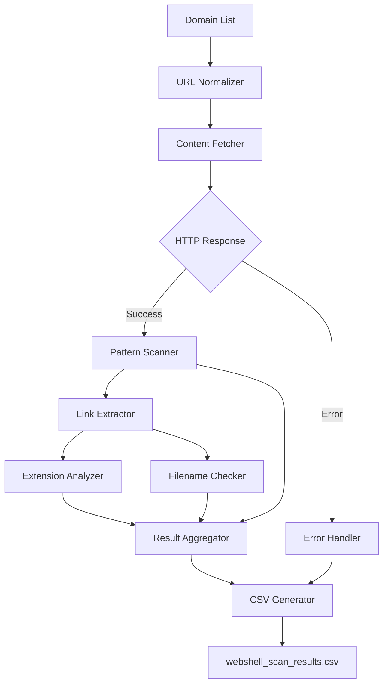
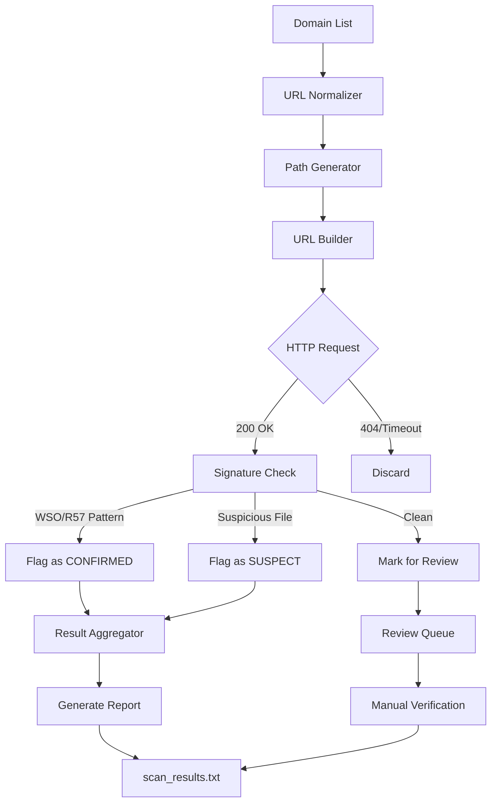

# **SWS - WebShell Scanner**  
**A PowerShell tool to detect webshells in mass domains.** 
SWS is a simple yet powerful tool used to detect webshell files in bulk across multiple domains. This tool is designed to help administrators, security researchers, and IT teams find potential compromises on websites, especially those using CMS such as WordPress, Joomla, and others. Using a combination of hundreds of common paths and popular shell file names, this tool automatically builds thousands of target URLs and examines server responses to identify suspicious files.

---

## **How It Works?**  

### **Version 1: Signature Scanner**  
Scans websites for common webshell patterns like `eval(base64_decode())`, `system()`, and known malicious filenames (`c99.php`, `r57.php`). Exports results in CSV format.  

**Usage:**  
```powershell
.\sws-v1.ps1 -DomainList targets.txt -OutputFile results.csv
```

### **Version 2: Path Brute-Forcer**  
Tests 100+ common webshell paths (e.g., `/uploads/shell.php`, `/wp-admin/cmd.php`) across multiple domains quickly. Outputs suspected URLs in a text file.  

**Usage:**  
```powershell
.\sws-v2.ps1
```

---

## **Architecture**  

### **Version 1 Flow**  


### **Version 2 Flow**  

---

Only use on systems you own or have permission to scan.** Unauthorized testing may violate laws.

Contact: [https://t.me/Ox6218]  

this tool can still be developed further, i just made it simple

---
